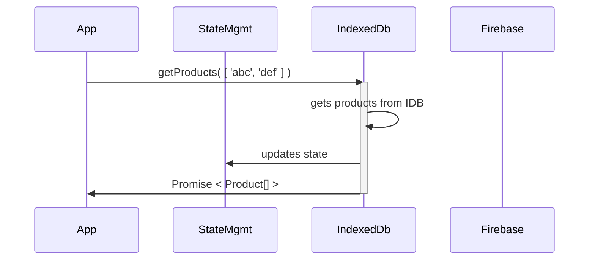

# Overview

This component library provides all 7 distinct chart types (see nav above for all types) that the [**roughViz.js**](https://github.com/inocan-group/roughViz#Bar) library exposes and helps to make them easy to use in VueJS (Vue 3.0+). To provide the underlying dependencies in a compact, tree-shakable form we have forked the original repo but the API remains untouched.

In the following sections we will go through each chart type specifically but there are strong _patterns_ in the API surface across all chart types so we'll hit those here. We'll also cover the use of _fonts_ (something that the non-forked version of roughViz doesn't manage very well).

## Common Parameters



### Data

The most important thing for any charting library is providing **data** so it can be visualized. As a user of the library you'll need to know both the _structure_ of the data as well as the _mechanism_ of passing it in. By default the structure and API method are exactly the same as what **roughViz** provides:

```html
<Bar :data="{ labels: ['a', 'b'], values: [10, 20] }" />
```

The the example we choose a bar chart but all charts take the `data` property to receive data. Also, as you can see the _structure_ of the data is such that the `labels` and `values` are defined separately. This structure is surprisingly common in charting libraries but often is awkward for programatic uses. For this reason we have provided a helper called `DataDictionary` which will allow the following:

```html
<Bar :data="DataDictionary( { a: 10, b: 20 } )" />
```
